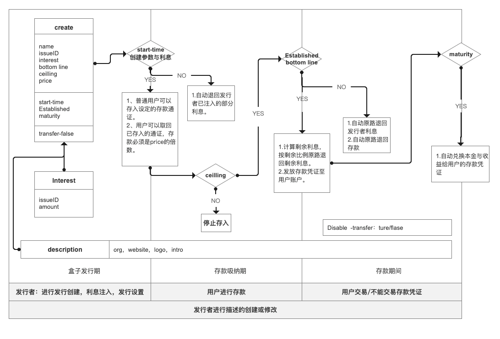

## HRC-12 DeposityBox存款协议(草稿)

### 简述

金融机构进行存款或期货交易。

### 摘要

Hashgard提供原生的存款服务协议。帮助金融机构进行流通资产的控制与管理。帮助金融机构通过适当的金融激励来稳定市场的经济与繁荣。为用户的金融行为提供更多的激励。

任何人都可以发行存款盒子，来达到发行者的金融目的。存款盒子的利息需要事先全额支出，整个存款盒子是存在于Hashgard系统中，不属于任何人，只有发行者在盒子设定的结束时间才能取回剩余利息。用户在盒子存款计息开始之前和存款盒子结束时间之后可以取回自己的本金和利息。发行者可以设置吸纳存款的种类，存款盒子的大小，开始时间，结束时间，计息所需要的达成的总体存款的最低额度。以及发放的利息的通证种类和数量。发行者可以设置用户持有的存款凭证是否可以进行交易。


## 存款盒子的三个时期




### 1.存款盒子发行期

- 发行者发行存款盒子，设定好存款的必要参数和利息注入。在start-time之前注入设定的利息数量。到达start-time进入存款吸纳期。
- 如果利息在start-time时不足存款盒子达成失败。
- 利息注入可以由多个账户注入。此期间仅接受利息限定种类通证注入。


### 2.存款吸纳期

- 时间点start-time到时间点Established，为存款吸纳期。
- 用户可以自由存入指定吸纳存款的通证。用户允许赎回。
- 如果存款达到ceilling值时候，停止接受存款。


### 3.存款期

- 时间点到达Established且存款达到bottom line，用户获得存款凭证。

- 存款凭证可根据盒子发行规则进行交易与否。

- 扣除达到份额的支出利息后的剩余利息，自动按比例返还给注入利息账户。

- 时间点到达maturity，自动兑换本金和利息至存入账户。

  

- 时间点到达Established且存款未达到bottom line，存款盒子达成失败。自动退回用户的本金和发行者的利息。


### gas费用

- 发行数据gas

-  成立失败或存款结束用于自动回退用户gas

- 存款成立时为每个用户将存款兑换盒子的gas

  

## 存款盒子发行

### 1.发行存款盒子 depostibox

```bash
hashgarlcli depostibox create [name][issueID][flags] --from
```

创建存款盒子包括名字，接受存款的通证类型，存款开始时间，结束时间。并设定利息的种类和数量。

#### name

存款盒子的名称，例如"gardfound01"。支持格式4～24字符之间。可重复、必填、不可修改。

#### issueID

存款盒子可接纳的存款通证种类。目前暂时仅支持单个。


### flags

| 名称           |  类型  | 是否必须 | 默认值 | 解释                                                         |
| -------------- | :----: | -------- | ------ | :----------------------------------------------------------- |
| --Bottom line  |  int   | 否       | 0      | 整个存款协议发放利息所设定的最低总存款条件条件限定。不设置默认为0。设定范围在0～ceiling之间。 |
| --ceiling      |  int   | 是       | ""     | 整个存款盒子最多容纳的存款数量。                             |
| --price        |  int   | 否       | 1      | 每份所需所需要的存款。                                       |
| -- transfer-on |  bool  | 否       | false  | 用户存款后的存款凭证是否可以进行交易                         |
| --Interest     | string | 是       | ""     | 利息的种类和数量                                             |
| --start-time   |  int   | 是       | ""     | 用户可以存入存款盒子的时间。利息必须在接受存款时间之前，注入到存款盒子中。否则盒子创建失败。 |
| --Established  |  int   | 是       | ""     | 存款开始计息的时间，                                         |
| --maturity     |  int   | 是       | ""     | 存款到期交割本金和利息时间。                                 |

整个存款盒子分为若干个份，price为每份的价格。存款必须为price的整数倍。获得凭证即为份数。如果发行者设定了可进行交易。那么交易数量必须为正整数。

举例：用户bobo花费了1000个gard， 购买了price的为100gard的存款盒子deposit001。那么获得10个deposit001，发行方设定可以转移。bobo出售1个deposit001给Alice。


### 2.对存款盒子进行利息注入

```bash
hashgardcli depostitbox send [depositboxid][amount] --from 
```

对指定存款盒子进行利息的充值。充值人可以不是盒子发行者。充值的的总额不能大于已经设定的利息总额。存款盒子参数和利息设置完成即可进入存款募集期。

#### depositboxid

存款盒子的唯一编码。

#### amount

利息由利息的通证种类和数量组成，利息可与吸纳的存款通证种类不一致。仅支持一种。


### 3.添加描述文件

```bash
hashgardcli despositbox description [description-file] --from
```


#### description 

发行存款盒子支持描述文件，格式支持json文件，大小不能超过1024字节。可选字段

- org 组织机构或个人名称 。
- Logo  通证项目图标或项目图标，仅支持网址链接。
- website  发行方官方的网站地址。
- intro  对于该项目的简单描述。

#### 模版

```json
{
  "org":"Hashgard天使轮释放",
  "website":"https://www.hashgard.com",
  "logo":"https://cdn.hashgard.com/static/logo.2d949f3d.png",
   "intro":"天使轮通证释放" 
}
```

> Message
>
> - error：file size cannot exceed 1024 byte.
> - 报错：file文件大小不能大于1024byte。
> - error：the file must be json。
> - 报错：文件格式为json。


#### issue-address

存款盒子发行者的地址。


#### coupon

单位凭证需要付出的利息。


## 赎回

#### redeem

```bash
hashgardcli despositbox redeem [amount] [despositboxID] --from 
```

用户可以在存款吸纳期对于已经存入的存款自由的进行取回。


## 存款盒子查询总数据


>**发行信息总览**
>
>name 存款盒子名称
>
>description 存款盒子描述
>
>- logo
>- org 组织机构或个人
>- description   盒子描述
>- Website 网站地址
>
>Issuer-address 发行者地址
>
>issuerId 存款通证类型
>
>start-time 存款吸纳开始时间
>
>Established 存款项目达成时间
>
>maturity本金与利息交割时间
>
>price 每份的价格
>
>Bottom line 存款达成底线
>
>ceiling 存款上限
>
>Interest 利息
>
>- address  注入利息的地址
> - amount 利息的数量
> - issueID 利息种类
>
>Disable 功能开关
>
>- transfer交易转移状态
>  - ture/false


>  存款信息
>
> Total deposit 总存款
>
> coupon 每份需要付出的利息数
>
> Share  总共出售的份数


> 用户存款信息
>
> address 用户地址
>
> amount  用户存款数量(存款吸纳期)
>
> - Issue
>
> amount 用户持有share的份数（存期）
>
> - depositboxID
>
> Redeemed/Unredeemed 用户存款本金和利息赎回状态


>transaction 交易
>
>- call-transaction 认购交易
>
>  - from_address
>
>  - amount
>
>  - time
>
>    
>
>- redemption-transaction赎回交易
>
>  - to_address
>  - amount
>  - time
>
>  
>
>- deposit-transaction 盒子交易
>
>  - to_address
>
>  - from_address
>
>  - amount
>
>  - time
>
>    
>
>- system-transaction  系统交易
>
>  - to_address
>  - amount
>  - time


### 搜索

```bash
hashgard despositbox sreach [name]
```


##### name

根据存款盒子进行查询name字段，返回发行信息list。


### 查询

```bash
hashgardcli desposit query[despositboxId][list][issue_adress] 
```


#### list

返回所有存款盒子发行信息list。


#### Issuer-address

按用发行存款盒子的地址进行查询。返回发行信息list。


#### despositBoxID

按存款盒子唯一编码进行查询。


### 存款凭证转让

```bash
hashgardcli bank send [amount]  -from= 
```

存款用户将自己手中的存款凭据整体或者部分进行转移给其他用户。该交易类型受到该发行设定中transfer-off开关控制。

