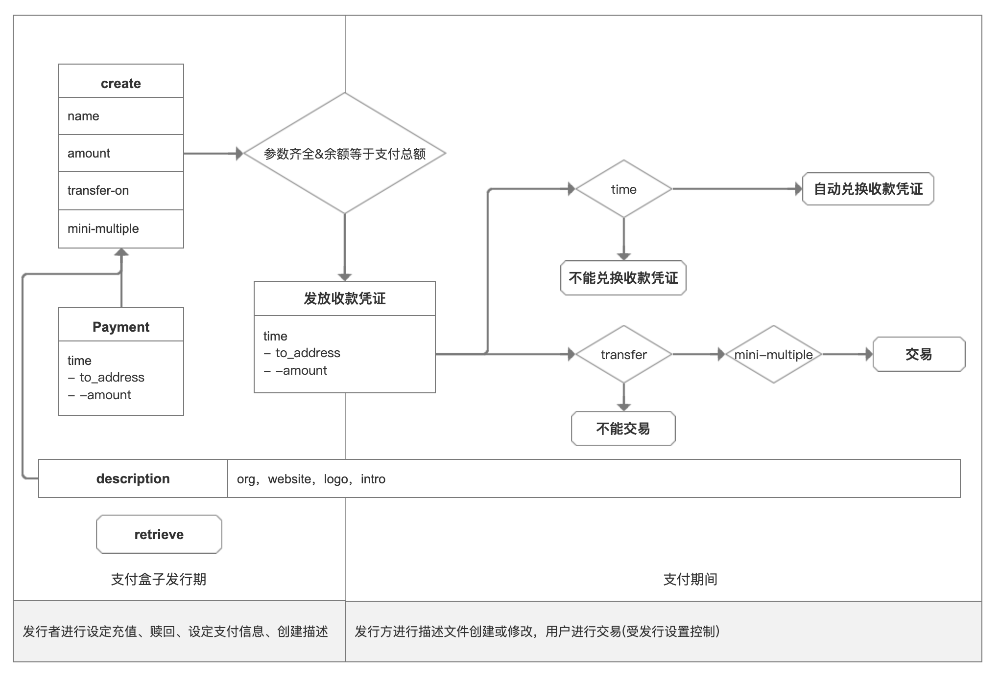

## HRC12 FutureBox 远期支付协议(草稿)

### 简述

在现实社会中约定的远期金融交易，具有公平公正，一旦约定，不受其他因素影响。

### 摘要

远期支付是一次性盒子，发行者可以持续为盒子进行充值，设定远期支付行为。

### 示例

Alice 和Bobo进行金融交易，Bobo给Alice给出一部分现实中的资产，Alice承诺在未来的一年内给予Bobo证券资产1000god，每个季度末尾付出250god。那么Alice创建了一个futurebox，并起名为Alice与Bobo资产互换一期，对futurebox存入1000个god 并设定当年每3月28、6月31日、9月30日、12月30各付出250god给Bobo。远期支付协议的优势，事先存入，一旦约定，将按预定的条件进行执行。不担心任何中途的其他人为意愿或者经济形势的变化而发生改变。充分的使用了区块链技术中不可逆的价值属性。




### 远期支付盒子分为两个时期

#### 支付盒子发行期

- 发行方创建盒子，注入利息，可以设置多个支付信息。设定必要参数后，支付账单的总额度=支付盒子注入额度，支付盒子激活并为用户发放带时间的收款凭证。
- 盒子发行期可以注入或者取回通证。

#### 支付期间

- 按照发行者设定的支付时间为将用户的收款凭证兑换为设定的通证。
- 用户获取收款凭证可进行交易。交易受发行支付盒子中交易功能和最小交易倍数影响。

### 远期支付盒子创建并充值

```bash
hashgardcli futurebox create [name][amount][transfer-on][mini-multiple]--form 
```

为远期支付盒子创建名字


#### create

创建

#### name

存款盒子的名称，例如"gardfound01"。支持格式4～24字符之间。可重复、必填、不可修改。

> error：name  is between 4 and 24 in length.


#### FutureBoxID

远期支付盒子唯一编号


#### amount

需要和issueID一起使用。

对远期支付盒子只能发行者进行充值，不允许非远期支付盒子用户进行充值。


#### transfer-on

设定收款账户是否可以将自己账户中的该凭证进行交易。


#### mini-multiple

交易最小倍率(默认为1)。


### 设定远期支付行为

```bash
hashgardcli  futurebox set [FutureBoxID][payment-file] --from 
```

为设定好的远期支付盒子设定支付行为。远期支付行为一旦设定，无法被取消。支付行为会按照设定的状态进行变更。


#### payment-file

发行存款盒子支持描述文件，格式为json文件，大小不能超过102400字节。

- time    需要兑现的时间。
- to_address. 收款地址。
- coins 需要支付的通证类型。
- Send 收款凭证的地址和每期数量。
- 支付的总额必须等于当前支付盒子的余额。

#### 模版

```json
{
   "time":["1557127578","1557127578","1557127578","1557127578"],
    "send":[
     ["gardvaloper1k67xljpc0lr678wyl6vld9hy3t2lc6ph2fecaf","188","200"],
     ["gardvaloper1k67xljpc0lr678wyl6vld9hy3t2lc6ph2fecaf","188","200"],
     ["gardvaloper1k67xljpc0lr678wyl6vld9hy3t2lc6ph2fecaf","188","200"]
    ]
    }
}
```


#### description 

发行存款盒子支持描述文件，格式支持json文件，大小不能超过1024字节。可选字段

- org 组织机构或个人名称 。
- Logo  通证项目图标或项目图标，仅支持网址链接。
- website  发行方官方的网站地址。
- intro  对于该项目的简单描述。

#### 模版

```json
{
  "org":"Hashgard天使轮释放",
  "website":"https://www.hashgard.com",
  "logo":"https://cdn.hashgard.com/static/logo.2d949f3d.png",
   "intro":"天使轮通证释放" 
}
```

> Message
>
> - error：file size cannot exceed 1024 byte.
> - 报错：file文件大小不能大于1024byte。
> - error：the file must be json。
> - 报错：文件格式为json。


## 赎回

#### redeem

```bash
hashgardcli futurebox retrieve[futureboxID][aomount] --from 
```

盒子发行者在未进行支付信息设置时候可以取回全部或者部分支付盒子中的通证。


## 支付盒子查询总数据


> 支付盒子信息总览
>
> name 支付盒子名称
>
> Issue-address 发行者地址
>
> time  发行时间
>
> description 存款盒子描述
>
> - logo
> - org 组织机构或个人
> - intro   盒子描述
> - Website 网站地址
>
> amount  通证数量
>
> - issue 通证种类
>
> Disable 功能开关
>
> - transfer交易转移状态
>   - ture/false
>
> status: inactivated/activated 激活状态


>支付信息
>
>time  时间
>
>- FutureBoxID-sequence  支付盒子ID-期数
>  - address  持有地址
>  - amount 持有数量
>
>- paid/unpaid  兑付状态


> transaction 交易
>
> - from_address
> - amount
> - time
>
> 
>
> - future-transaction 支付盒子交易
> - to_address
> - from_address
> - amount
> - time
>
> 
>
> - system-transaction  系统交易
> - to_address
> - amount
> - time

### 搜索

```
hashgardcli futurebox sreach [name]
```

##### name

按照支付盒子的名字进行搜索


### 查询

```
hashgardcli futurebox query [issue_adrress] [futuerboxID][to_address]
```

进行精确的匹配查询。


#### issue_adrress

按照支付盒子发行者地址进行查询，


#### futuerboxID

按照支付盒子的唯一编码进行查询，


#### FutureBoxID-sequence

按照支付盒子唯一编码+期数查询，


#### futuerboxID to_address

按照指定支付盒子编码查询支付地址信息。


