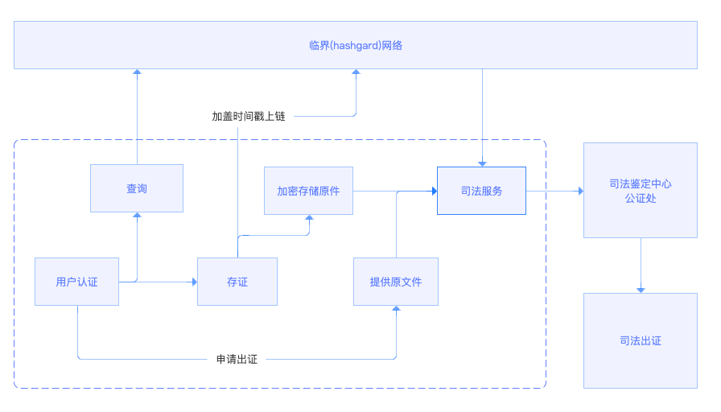

## HRC-13 Recording 存证服务

#### 简述

整个金融行业，对于部分电子合同、交易数据、业务数据等有需要进行查询和在必要的时候进行公证的需求。服务由三部分构成。


#### 摘要

对于金融行业来讲，由于金融风控市场起步比较晚，

存证是一个集数字签名、司法服务、加密存储、区块链的复杂的金融的活动。


### 企业服务

##### 用户确权

经过权威的第三方进行用户或企业组织的对注册用户的资料进行审核确认身份。创建数字身份ID。

##### 用户存证

认证用户或者企业组织进行电子合同、交易数据、业务数据等进行hash计算，或者直接上传文件。

##### 数据上链

服务企业将文件的hash和作者等信息传入区块链。

##### 用户取证

用户在提供存证后的流水单号或者文件hash，自存文件的用户提供文件本身。提交给服务企业法律部门进行代理提交。

##### 用户查询

用户对现有的数据

##### 司法服务

帮助用户取得司法鉴定中心公证处需要的完备的取证文件


### 区块链网络

公立的完备的区块链网络


### 司法鉴定中心公证处

需要进行取证的合法机构

<a data-fancybox  href="imges/recording.png"></a>

### 存证


```bash
hashgardcli recording [name][content][author] --from --memo
```


#### name

存证内容标题

#### content

需要存储的内容哈希

#### authorID

存证作者

#### from_address

存证提交账户

#### memo

扩展信息

#### 扩展模版

```
{
  "Numbering":"yuandian_5cd241b5f26056.50355574",//记录编号
  "type":"合作备忘录",//类别：电子合同 数据等等
  "URL":"https://www.hashgard.com",//内容原地址
  "Summary":"与cosmos合作备忘录",//摘要
  "author":"苏轼",//作者
  "Signature":"863dc8596f1f7c9c34d86d1c4885d186e18033fa67288d83e9a1a3edd4e6\
 6e442c2d071254e47d8d89da86b221b0e8f8f9f0f63815404f57f9b5a808b1496c9b1b" //数字签名
 "Public key":"02e74c607a90bc1f64dbf7c35065721399163a56fa9580985a292f9e7c015ebe57",//公钥
}
```


#### time

存证时间

#### height

区块高度

#### tx

交易hash


### 查询

#### 

